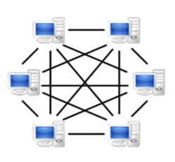
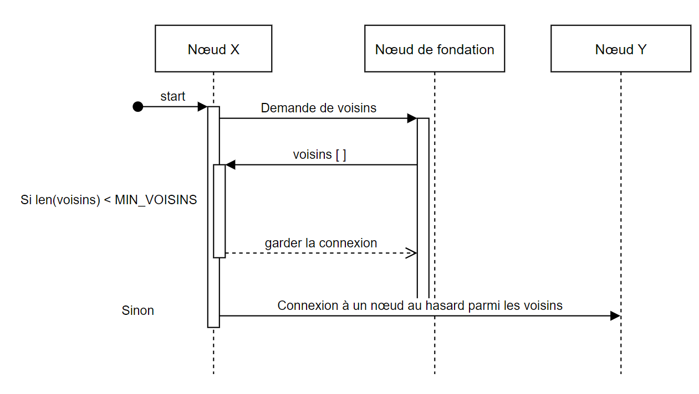

# Version Peer To Peer

## Introduction

Dans cette version chaque client est un serveur en même temps

## Explication de notre implémentation :

Nous avons défini un Nœud de fondation, ce dernier sera le point d'entrée au réseau.

Au lancement, tout les nœuds se connectent au nœud de fondation, et ils demandent les voisins de ce dernier, à la réception des voisins, si le nombre est inferieur à une constante définie, on garde la connexion au serveur, dans le cas contraire on prend les voisins (serveur de fondation inclu). On prend deux au hasard et on se connecte à eux.

Pour éviter des cycle de Broadcast, nous avons mis en place un système d'empreinte ce qui permet de savoir si nous avons déja traiter le message dont il est question
